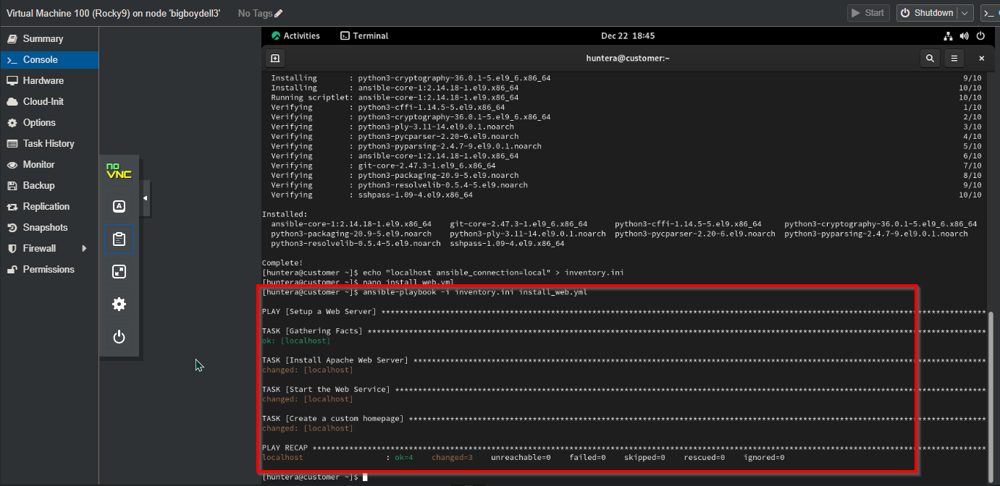
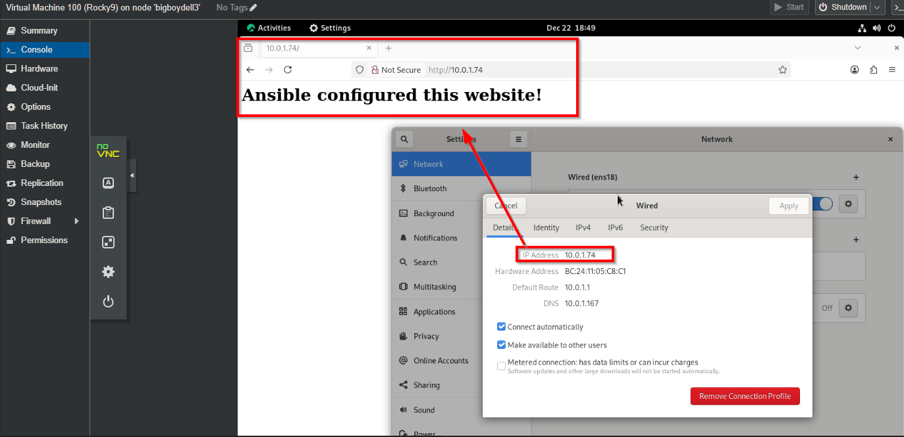

# Ansible Web Server Automation and Bootstrapping

An Ansible playbook plus a Bash bootstrap script that take a fresh Rocky Linux 9 machine to a running Apache web server in one command. Built to practice infrastructure as code: describe the server's state once, then let Ansible enforce it.

## Files

- [setup.sh](setup.sh): checks for root, installs `ansible-core` if it's missing, then runs the playbook
- [inventory.ini](inventory.ini): defines the `webservers` group (the local machine for this lab)
- [install_web.yml](install_web.yml): installs Apache, starts and enables it, and deploys a homepage

## How it works

### 1. Inventory
For this lab the target is the control node itself, connected locally:

```ini
[webservers]
localhost ansible_connection=local
```

### 2. Playbook
`install_web.yml` runs three tasks against `webservers`:
- Install `httpd` with `dnf`
- Start the `httpd` service and enable it at boot
- Write a custom `index.html` to `/var/www/html`

Each task is idempotent, so running the playbook again changes nothing unless something has drifted.

### 3. Bootstrap script
`setup.sh` makes the run repeatable on a fresh machine. It stops if it isn't run as root, installs `ansible-core` if Ansible isn't present, then calls `ansible-playbook` with the inventory.

## Run it

```bash
git clone https://github.com/hunterraustin/Ansible-Web-Server-Automation-and-Bootstrapping.git
cd Ansible-Web-Server-Automation-and-Bootstrapping
sudo bash setup.sh
curl http://localhost
```

## Result

The playbook installed and started Apache and deployed the homepage with no manual steps.





## References
- [Video: Installing Ansible on Rocky Linux 9](https://youtu.be/Cj9TOEGtbfM)
- [Video: Ansible playbook beginners tutorial](https://youtu.be/FZ8400kGa_4)
